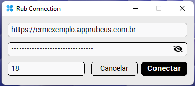
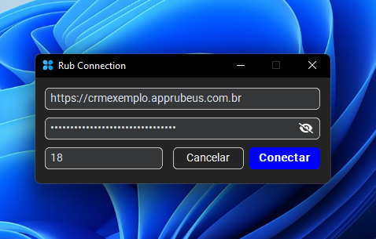
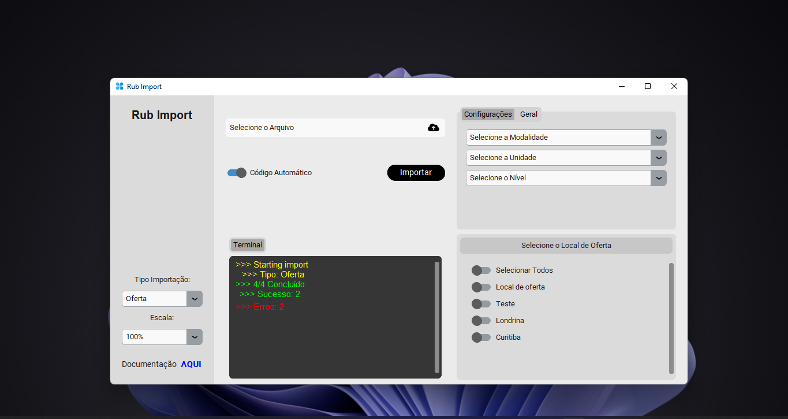
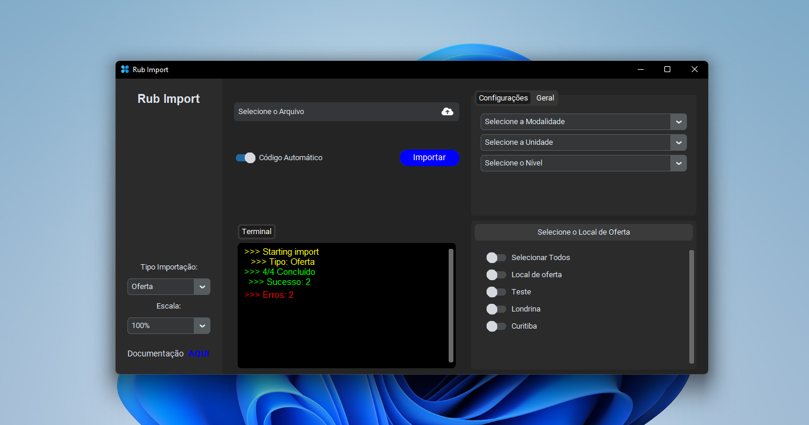
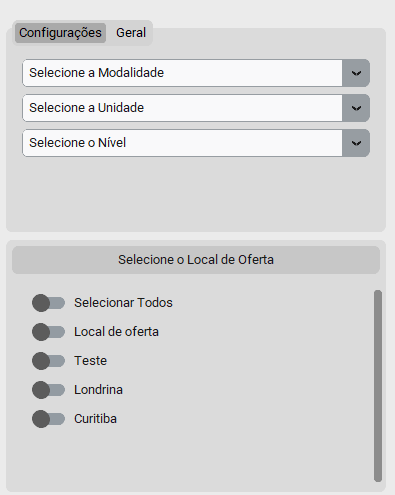
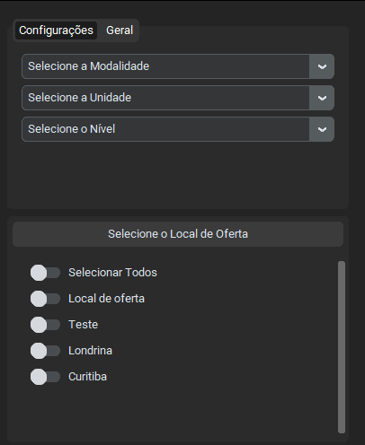
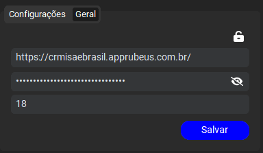

Bem-vindo ao **Rub Import** - Sua solução eficiente para importação em massa de cursos e ofertas educacionais para o CRM!

## Sobre 📚

O **Rub Import** é uma aplicação desenvolvida para simplificar o processo de importação de cursos e ofertas de cursos em grande escala para o CRM Rubeus.

Através do upload de arquivos no formato '.xlsx', os usuários podem facilmente integrar dados importantes ao sistema, economizando tempo e aumentando a eficiência operacional.

## Instalação 🔧

Para instalar o **Rub Import**, siga estas etapas:

1. [Download](Rub-Import.zip)
2. Execute o instalador e siga as instruções na tela.
3. Para que a instalação seja bem sucedida, crie uma nova pasta no 'Disco Local', para ser o local do executável.

**Importante:**
- Não instale em 'Arquivos e Programa', a aplicação pode não executar corretamente.
- Crie um atalho para sua Área de Trabalho

## Modelos de Planilha 📊

Para facilitar a preparação dos seus dados, fornecemos modelos de planilha para cursos e ofertas:

- [Modelo de Planilha para Cursos](https://docs.google.com/spreadsheets/d/10aFLe_ksrdlwmOY-8jUhWdUA7fP93AfAy_ncLWPh24c/edit?usp=sharing)
- [Modelo de Planilha para Ofertas](https://docs.google.com/spreadsheets/d/1pC2kkXRw2j5cBaZewgJ0K8vX7UrMnipUTUpz5L5YC3w/edit?usp=sharing)

Certifique-se de seguir o formato fornecido nos modelos para garantir uma importação suave.

## Passo 1: Autenticação 🔑

Antes de começar, é necessário autenticar-se na aplicação. Siga estes passos:

1. Acesse a tela de login.
2. Informe o link da base (CRM), a chave de autenticação (token), e o número de origem que identifica o canal na base.

  
  

## Passo 2: Navegação na Tela Inicial 🏠

Após a autenticação bem-sucedida, você será direcionado para a tela inicial, que oferece uma experiência intuitiva e amigável.

  
  

Aqui estão as principais funcionalidades:

### Menu Lateral Esquerdo 📂

- **Escolha do Tipo de Importação**: Selecione entre importar um "Curso" ou uma "Oferta".
- **Configurações de Zoom**: Ajuste a escala do documento para melhor visualização.

### Área Principal 📄

- **Upload de Arquivo**: Faça o upload de arquivos '.xlsx' contendo os dados desejados.
- **Opção de Geração Automática de Código**: Ative o switch para gerar automaticamente códigos.
- **Terminal de Status**: Acompanhe o status da importação em tempo real.

### Configurações Específicas para Oferta (Lateral Direita) ⚙️

- **Seleção de Unidade, Nível de Ensino, Modalidade e Local de Oferta**: Configurações específicas para ofertas educacionais.

  
  

### Configurações Gerais ⚙️

- **Informações de Destino**: Edite informações essenciais como token e origem diretamente na aplicação, sem precisar logar novamente.

  
  

Para alterar as informações, basta clicar sobre o cadeado na parte superior direita para desbloquear os campos, e após fazer a alteração clica em "Salvar", para concluir as alterações.

## Como Usar ▶️

1. Autentique-se na aplicação seguindo os passos do **Passo 1**.
2. Na tela inicial, escolha o tipo de importação e ajuste as configurações conforme necessário.
3. Faça o upload do arquivo contendo os dados desejados.
4. Acompanhe o status da importação no terminal.
5. Personalize as configurações adicionais conforme a necessidade.

## Boas Práticas 🌟

Aqui estão algumas dicas úteis para aproveitar ao máximo o **Rub Import**:

1. **Prepare Seus Dados:** Certifique-se de que seus arquivos de planilha estão formatados corretamente antes da importação para evitar problemas durante o processo.

2. **Aproveite os Modelos:** Use nossos modelos de planilha fornecidos para garantir que seus dados estejam no formato certo.

2. **Acompanhe o Status:** Utilize o terminal de status na área principal para acompanhar o progresso das importações. Se ocorrer erros basta abrir sua planinha novamente, que o status de cada item estará na coluna 'D'.

5. **Teste em Ambiente de Desenvolvimento:** Antes de realizar importações em larga escala, faça testes em um ambiente de desenvolvimento para garantir que tudo funcione conforme esperado.

6. **Contribua para o Desenvolvimento:** Se encontrar problemas ou tiver sugestões, sinta-se à vontade para contribuir para o desenvolvimento do **Rub Import**.

## Contribuição 🤝

Sinta-se à vontade para contribuir para o desenvolvimento do **Rub Import**! Confira nossas [diretrizes de contribuição](CONTRIBUTING.md) para mais detalhes.

## Problemas e Suporte 🚨

Encontrou um problema ou precisa de ajuda? Relate [aqui](https://github.com/seu-usuario/rub-import/issues).
